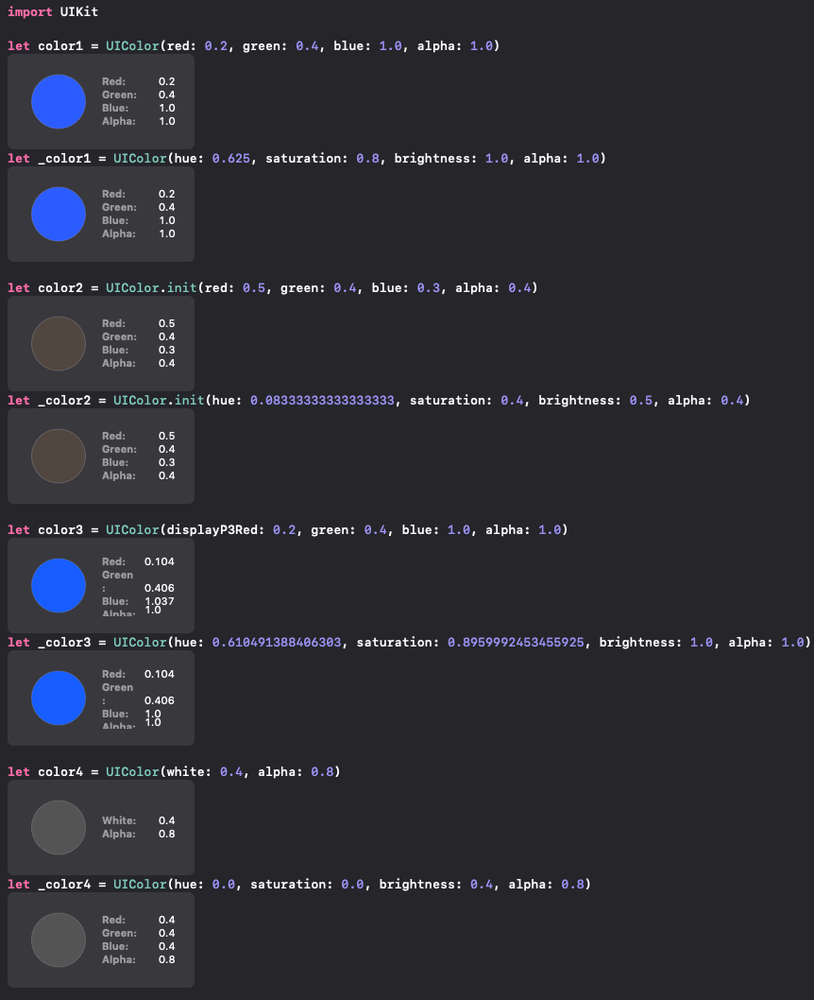

# AbsoluteHSB

[](https://swift.org/download/)

## Overview

CLI to change all Swift UIColor initializer to HSB initializer

## Requirements

Swift 4.2+
Xcode 10+

## Installation

Run make command.

```
$ make install
```

## Usage

When you write Swift code like below:

```swift
import UIKit

let color1 = UIColor(red: 0.2, green: 0.4, blue: 1.0, alpha: 1.0)
let color2 = UIColor.init(red: 0.5, green: 0.4, blue: 0.3, alpha: 0.4)
let color3 = UIColor(displayP3Red: 0.2, green: 0.4, blue: 1.0, alpha: 1.0)
let color4 = UIColor(white: 0.4, alpha: 0.8)
```

Then you run this command, you can get like this:

```swift
import UIKit

let color1 = UIColor(hue: 0.625, saturation: 0.8, brightness: 1.0, alpha: 1.0)
let color2 = UIColor.init(hue: 0.08333333333333333, saturation: 0.4, brightness: 0.5, alpha: 0.4)
let color3 = UIColor(hue: 0.610491388406303, saturation: 0.8959992453455925, brightness: 1.0, alpha: 1.0)
let color4 = UIColor(hue: 0.0, saturation: 0.0, brightness: 0.4, alpha: 0.8)
```

Of course, the output of these code is same. (note: Color with display P3 color space will sometimes change because of changing color space)



### Available Command

#### dump

This command output converted code to standard ouput.

```sh
$ absolute-hsb dump <file-path>
```

#### rewrite

This command replace original code with converted code.

```sh
$ absolute-hsb rewrite <file-path>
```

#### help

This command show the help.

```sh
$ absolute-hsb help
```

## Author

- [touyou](https://touyou.dev)
  - @touyou

## License

MIT License.

## Special Thanks

This library based on [this entry](https://yutailang0119.hatenablog.com/entry/swift-syntax-uicolor) and [library](https://github.com/yutailang0119/swift-color-detector).
